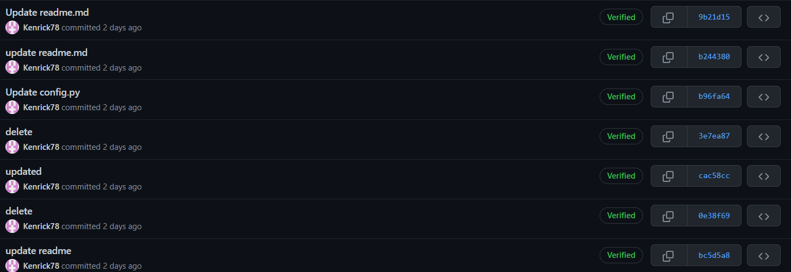

# Environment Setup
This page details how to setup the environment step-by-step.

- [Environment Setup](#environment-setup)
- [Configure Signed Requests](#configure-signed-requests)
  - [1. Install Git Bash and [GPG4Win](https://www.gpg4win.org/)](#1-install-git-bash-and-gpg4win)
  - [2. Generate GPG Key Pair](#2-generate-gpg-key-pair)
  - [3. Check if key exists](#3-check-if-key-exists)
  - [4. Share public key (Note: `3AA5C34371567BD2` is what you see from the previous step at the first line)](#4-share-public-key-note-3aa5c34371567bd2-is-what-you-see-from-the-previous-step-at-the-first-line)
  - [5. Export Public Key from Key ID](#5-export-public-key-from-key-id)
  - [6. Configure GPG program](#6-configure-gpg-program)
  - [7. (Optional) Disable TTY (if using CLI in IDE like VS Code)](#7-optional-disable-tty-if-using-cli-in-ide-like-vs-code)
  - [8. Verify](#8-verify)
- [Python Environment](#python-environment)
  - [Prerequisites](#prerequisites)
  - [Configure Python Environment](#configure-python-environment)
  - [Install Docker](#install-docker)
  - [Configuration](#configuration)

# Configure Signed Requests
Follow the [guide](https://medium.com/@petehouston/quick-guide-to-sign-your-git-commits-c11ce58c22e9). 
All Commands (if not stated) are done in windows powershell.

## 1. Install [Git Bash](https://git-scm.com/download/win) and [GPG4Win](https://www.gpg4win.org/)
## 2. Generate GPG Key Pair

```console
# gpg --default-new-key-algo rsa4096 --gen-key

Key Size: 4096
Expiry: No expire
Name: <Github username>
Email: <Github email>

NOTE: To check your git configured email and name
# git config --list
# git config --global --list
# git config user.email
# git config user.name

To set Email and name
# git config --global user.name <name>
# git config --global user.email <email>
```

## 3. Check if key exists

```console
# gpg --list-secret-keys --keyid-format LONG
...
/Users/hubot/.gnupg/secring.gpg
------------------------------------
sec 4096R/3AA5C34371567BD2 2016-03-10 [expires: 2017-03-10]
uid                        Hubot 
ssb 4096R/42B317FD4BA89E7A 2016-03-10
```

## 4. Share public key (Note: `3AA5C34371567BD2` is what you see from the previous step at the first line)

```console
# gpg --send-keys 3AA5C34371567BD2
```

## 5. Export Public Key from Key ID

```console
# gpg --armor --export 3AA5C34371567BD2
-----BEGIN PGP PUBLIC KEY BLOCK-----
KEY_CONTENT....
-----END PGP PUBLIC KEY BLOCK-----
```

- Go to [Settings > SSH and GPG keys](https://github.com/settings/keys) section on Github.
- Click green button to add new GPG Key
- Copy Paste the public key from the command above

## 6. Configure GPG program

**Windows (Git bash)**
```console
# git config --global gpg.program "C:\Program Files (x86)\GnuPG\bin\gpg.exe"
# git config --global user.signingkey 3AA5C34371567BD2
# git config --global commit.gpgsign true

IMPORTANT: Ensure environment variable set
$env:GNUPGHOME='C:\Users\user\AppData\Roaming\gnupg'
```

**Linux**
```console
$ which gpg
/usr/local/bin/gpg
$ git config --global gpg.program "/usr/local/bin/gpg"
```

## 7. (Optional) Disable TTY (if using CLI in IDE like VS Code)

```console
$ echo 'no-tty' >> ~/.gnupg/gpg.conf
```

## 8. Verify
Try committing to git and you should see the `Verified` badge at the side of the commit.




# Python Environment

## Prerequisites
Ensure the following software are installed before continuing.
- `Python 3.8+`
- `pip`
- `venv`

## Configure Python Environment
1. Install `Python 3.8+` in the environment of choice

```console
# Verify Python Install
$ python3 --version
```

2. Ensure that `pip` is installed

```console
$ pip --version
```

3. Create the virtual environment

**Linux**
```console
$ cd services/web
$ python3 -m venv venv
$ source venv/bin/activate
$ pip install -r requirements.txt
```

**Windows**
```console
$ cd services\web
$ py -3.9 -m venv venv
$ venv\Scripts\activate
$ pip install -r requirements.txt
```

4. Environment Variables Setup

> Check Discord for the environment files and add them to project root

**Windows**
```console
CMD
$ set FLASK_APP="cmsapp/__init__.py"

Powershell
$ $env:FLASK_APP = "cmsapp/__init__.py"
```

**Linux**
```console
$ export FLASK_APP=cmsapp/__init__.py
```

5. Start the app with:
- Build containers with names
- Run this in project root

**Development**
```console
$ docker-compose up -d --build
```

> Refer to [DB commands](workflow.md#db-commands)

**Teardown**
```console
$ docker-compose down -v
```

- If error `Error response from daemon: failed to create shim task: OCI runtime create failed: runc create failed: unable to start container process: exec: "/home/cms/web/entrypoint.sh": permission denied: unknown`
  - Navigate to `services/web/entrypoint.sh`
  - Change from `CRLF` to `LF`
  - In linux: `chmod +x entrypoint.sh`

## Install Docker
1. Install [Docker Desktop](https://www.docker.com/)
2. *(Optional)* Install a WSL2 Distro
3. *(Optional)* Configure WSL2 Distro with [Docker Desktop support](https://docs.docker.com/desktop/windows/wsl/)

## Configuration
Follows this guide on [Dockerizing Flask with Postgres, Gunicorn, and Nginx](https://testdriven.io/blog/dockerizing-flask-with-postgres-gunicorn-and-nginx)